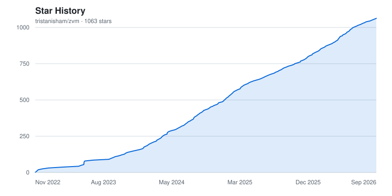

<p align="center">
  
</p>

Zig Version Manager (zvm) is a tool for managing your
[Zig](https://ziglang.org/) installs. With std under heavy development and a
large feature roadmap, Zig is bound to continue changing. Breaking existing
builds, updating valid syntax, and introducing new features like a package
manager. While this is great for developers, it also can lead to headaches when
you need multiple versions of a language installed to compile your projects, or
a language gets updated frequently.

## Donate

- [Paypal](https://www.paypal.com/donate/?hosted_button_id=HFTFEFXP2A388)

## Join our Community

- [Twitch](https://twitch.tv/atalocke)
- [Twitter|X](https://twitter.com/atalocke)

<a href="https://polar.sh/tristanisham"><picture><source media="(prefers-color-scheme: dark)" srcset="https://polar.sh/embed/subscribe.svg?org=tristanisham&label=Subscribe&darkmode"></picture></a>

# Installing ZVM

ZVM lives entirely in `$HOME/.zvm` on all platforms it supports. Inside of the
directory, ZVM will download new ZIG versions and symlink whichever version you
specify with `zvm use` to `$HOME/.zvm/bin`. You should add this folder to your
path. After ZVM 0.2.3, ZVM's installer will now add ZVM to `$HOME/.zvm/self`.
You should also add this directory as the environment variable `ZVM_INSTALL`.
The installer scripts should handle this for you automatically on *nix and
Windows systems.

If you don't want to use `ZVM_INSTALL` (like you already have ZVM in a place you
like), then ZVM will update the exact executable you've called `upgrade` from.

All installation scripts hosted on `www.zvm.app` are identical to, and are
automatically synced with their respective copies on GitHub.

```
www.zvm.app/install.sh === ./install.sh
```

# Linux, BSD, MacOS, *nix

```sh
curl https://www.zvm.app/install.sh | bash
```

<!-- This script will **automatically append** ZVM's required environment variables (see below) to `~/.profile` or `~/.bashrc`. -->

<!-- If these files don't exist, append the following to your shell's startup script.
```sh
echo "# ZVM" >> $HOME/.profile
echo export ZVM_INSTALL="$HOME/.zvm/self" >> $HOME/.profile
echo export PATH="$PATH:$HOME/.zvm/bin" >> $HOME/.profile
echo export PATH="$PATH:$ZVM_INSTALL/" >> $HOME/.profile
``` -->

# Windows

## PowerShell

```ps1
irm "https://www.zvm.app/install.ps1" | iex
```

## Command Prompt

```cmd
powershell -c "irm https://www.zvm.app/install.ps1 | iex"
```

# If You Have a Valid Version of Go Installed

```sh
go install -ldflags "-s -w" github.com/tristanisham/zvm@latest
```

## Manually

Please grab the
[latest release](https://github.com/tristanisham/zvm/releases/latest).

Alternatively, you can build the app by cloning the repository and running

```bash
go build .
./zvm
```

If you want to disable that ZVM can automatically update itself, you can run

```bash
go build -tags noAutoUpgrades .
```

instead for building the app.

## Putting ZVM on your Path

ZVM requires a few directories to be on your `$PATH`.

### Linux, BSD, MacOS, *nix

The installer script handles this for you automatically. If you need to set it
up manually, append the following to your shell's startup file (`~/.bashrc`,
`~/.zshrc`, or `~/.profile`):

```sh
export ZVM_INSTALL="$HOME/.zvm/self"
export PATH="$HOME/.zvm/bin:$ZVM_INSTALL:$PATH"
```

Then restart your shell or `source` the file for the changes to take effect.

### Windows

If you don't know how to update your environment variables permanently on
Windows, you can follow
[this guide](https://www.computerhope.com/issues/ch000549.htm). Once you're in
the appropriate menu, add or append to the following environment variables:

Add

- ZVM_INSTALL: `%USERPROFILE%\.zvm\self`

Append

- PATH: `%USERPROFILE%\.zvm\bin`
- PATH: `%ZVM_INSTALL%`

## Configure ZVM path

It is possible to overwrite the default behavior of ZVM to adhere to XDG
specification on Linux. There's an environment variable `ZVM_PATH`. Setting it
to `$XDG_DATA_HOME/zvm` will do the trick.

## Community Package

### AUR

`zvm` on the [Arch AUR](https://aur.archlinux.org/packages/zvm) is a
community-maintained package, and may be out of date.

# Why should I use ZVM?

While Zig is still pre-1.0 if you're going to stay up-to-date with the master
branch, you're going to be downloading Zig quite often. You could do it
manually, having to scroll around to find your appropriate version, decompress
it, and install it on your `$PATH`. Or, you could install ZVM and run
`zvm i master` every time you want to update. `zvm` is a static binary under a
permissive license. It supports more platforms than any other Zig version
manager. ZVM has no system dependencies. Whether you're on
Windows, MacOS, Linux, a flavor of BSD, or Plan 9 `zvm` will let you install,
switch between, and run multiple versions of Zig.

# Using ZVM with AI coding agents

ZVM ships one portable agent skill with plugin manifests for Claude Code and
Codex. It teaches coding agents to reach for `zvm` instead of a distro package
or a hand-unpacked tarball, and to drive it correctly when they do.

### Claude Code

```
/plugin marketplace add tristanisham/zvm
/plugin install zvm
```

The same commands are also available from a shell:

```sh
claude plugin marketplace add tristanisham/zvm
claude plugin install zvm@zvm
```

### Codex and other agents

The repository includes a Codex plugin manifest at `.codex-plugin/plugin.json`.
The underlying `skills/zig-versions/` directory uses the portable Agent Skills
layout, so other skill-compatible agents can load that directory directly.

The shared skill covers ZVM's real command surface, how to find the version a
repository actually wants (`//! zvm-lock:` in `build.zig`,
`.minimum_zig_version` in `build.zig.zon`), and why agents should prefer
`zvm run` over `zvm use` so they never repoint your global Zig without being
asked. The command reference is generated from ZVM's own CLI definition, so it
cannot drift from the binary.

# Contributing and Notice

`zvm` is stable software. Pre-v1.0.0 any breaking changes will be clearly
labeled, and any commands potentially on the chopping block will print notice.
The program is under constant development, and the author is very willing to
work with contributors. **If you have any issues, ideas, or contributions you'd
like to suggest
[create a GitHub issue](https://github.com/tristanisham/zvm/issues/new/choose)**.

# How to use ZVM

## Install

```sh
zvm install <version> 
# Or
zvm i <version>
```

Use `install` or `i` to download a specific version of Zig. You can pass an
exact version, a [shorthand](#version-shorthand), or an
[alias](#version-aliases).

```sh
zvm i 0.13.0      # Install an exact version
zvm i master      # Install the current master nightly
zvm i stable      # Install the latest stable release
zvm i .14         # Shorthand — installs 0.14.x (latest patch)
```

### Version Shorthand

You can use abbreviated version numbers and ZVM will resolve them to the
**latest matching release**:

```sh
zvm i 0.13     # Installs 0.13.0
zvm i .13      # Same as above — a leading dot implies "0."
zvm i 0.15     # Installs 0.15.2 (latest 0.15.x patch)
zvm i .15      # Same — resolves to 0.15.2
```

Whenever ZVM expands a shorthand, it prints the result so you know exactly
what's being fetched:

```
$ zvm i .14
Resolved ".14" to 0.14.1
...
```

Shorthand works across every command that takes a version:

```sh
zvm i 0.14      # install
zvm use .13     # switch active version
zvm run 0.12 version
zvm rm .11      # uninstall
```

For `use` and `rm`, shorthand is resolved against your **locally installed**
versions. For `install` and `run`, it resolves against the **remote** version
map.

### Version Aliases

ZVM understands a few named aliases in addition to concrete versions:

| Alias    | Resolves to                                              |
| -------- | -------------------------------------------------------- |
| `master` | The current `master` nightly build (passes through as-is) |
| `stable` | The highest non-dev, non-master release (e.g. `0.16.0`)  |

```sh
zvm i stable        # Install the latest stable release
zvm use stable      # Switch to the latest installed stable release
zvm i master        # Install the current master nightly
```

`stable` is especially useful in automation — you don't have to know the exact
version number to grab the newest release.

You can also create your own named aliases with the [`alias` command](#alias-your-zig-versions).

### Force Install

As of `v0.7.6` ZVM will now skip downloading a version if it is already
installed. You can always force an install with the `--force` or `-f` flag.

```sh
zvm i --force master
```

You can also enable the old behavior by setting the new `alwaysForceInstall`
field to `true` in `~/.zvm/settings.json`.

### Install a Specific Development Build

Zig development builds can be installed by their full build identifier, such as
`0.16.0-dev.1334+06d08daba`. ZVM downloads these builds directly from
`ziglang.org/builds` because they are not listed in the release version map.

Development builds do not have a version-map SHA-256 checksum. ZVM warns about
this and asks for confirmation before continuing:

```sh
zvm i 0.16.0-dev.1334+06d08daba
```

For an explicit non-interactive install, pass `--skip-shasum` (or `-s`). This
also skips SHA-256 verification for regular Zig and ZLS installations, so use
it only when you accept that risk:

```sh
zvm i --skip-shasum 0.16.0-dev.1334+06d08daba
```

### Customize HTTP Timeout
You can pass a custom HTTP timeout (in seconds) for `zvm i` using the `--http.timeout` flag or by setting the `ZVM_HTTP_TIMEOUT` environment variable.

```sh
zvm i --http.timeout 30
```

### Install ZLS with ZVM

You can now install ZLS with your Zig download! To install ZLS with ZVM, simply
pass the `--zls` flag with `zvm i`. For example:

```sh
zvm i --zls master
```

### Install for a Different Target Platform

If you're on a platform where pre-built Zig binaries aren't available for a
specific version (e.g., FreeBSD for Zig 0.14.x), you can override the target
OS and/or architecture to download a compatible build.

Use the `--target-os` and `--target-arch` flags:

```sh
zvm i --target-os linux --target-arch x86_64 0.14.0
```

Or set the `ZVM_TARGET_OS` and `ZVM_TARGET_ARCH` environment variables:

```sh
export ZVM_TARGET_OS=linux
export ZVM_TARGET_ARCH=x86_64
zvm i 0.14.0
```

Both Go-style names (e.g., `darwin`, `amd64`) and Zig-style names (e.g.,
`macos`, `x86_64`) are accepted.

#### Select ZLS compatibility mode

By default, ZVM will install a ZLS build, which can be used with the given Zig
version, but may not be able to build ZLS from source. If you want to use a ZLS
build, which can be built using the selected Zig version, pass the `--full` flag
with `zvm i --zls`. For example:

```sh
zvm i --zls --full master
```

> [!IMPORTANT]
> This does not apply to tagged releases, e.g.: `0.13.0`

## Switch between installed Zig versions

```sh
zvm use <version>
```

Use `use` to switch between versions of Zig. The version argument accepts
[shorthand](#version-shorthand) and [aliases](#version-aliases).

```sh
zvm use master     # Switch to master
zvm use stable     # Switch to the latest installed stable release
zvm use 0.13       # Resolves to 0.13.x (latest installed patch)
zvm use .14        # Same — leading dot implies "0."
```

## Alias your Zig versions

Use `alias` (or `kv`) to give an installed Zig version a custom name. The version must already be installed, and shorthand is supported.

```sh
zvm alias work 0.13.0    # Point "work" at 0.13.0
zvm alias play .14       # Resolve to the latest installed 0.14.x
zvm use work             # Switch versions by alias
zvm run play version     # Run a command with the aliased version
```

Aliases work with `install`, `use`, `run`, and `rm`. Setting an existing name updates it.

```sh
zvm alias                # List all aliases
zvm alias work           # Print one alias
zvm alias -d work        # Delete one alias
zvm alias --clear        # Delete all aliases
```

## List installed Zig versions

```sh
# Example
zvm ls
```

Use `ls` to list all installed version of Zig.

### List all versions of Zig available

```sh
zvm ls --all
```

The `--all` flag will list the available versions of Zig for download. Not the
versions locally installed.

### List set version maps

```sh
zvm ls --vmu
```

The `--vmu` flag will list set version maps for Zig and ZLS downloads.

## Uninstall a Zig version

```sh
zvm rm 0.10.0      # Remove an exact version
zvm rm .13         # Shorthand — removes the installed 0.13.x
zvm rm stable      # Alias — removes the installed stable release
```

Use `uninstall` or `rm` to remove an installed version from your system.
The version argument accepts [shorthand](#version-shorthand) and
[aliases](#version-aliases), resolved against what you have installed locally.

## Upgrade your ZVM installation

As of `zvm v0.2.3` you can now upgrade your ZVM installation from, well, zvm.
Just run:

```sh
zvm upgrade
```

The latest version of ZVM should install on your machine, regardless of where
your binary lives (though if you have your binary in a privileged folder, you
may have to run this command with `sudo`).

### Install via Package Manager

ZVM (> v0.8.14) can also be built without its auto upgrader (`zvm upgrade`).
This is to make installing ZVM via a package manager easier for those who prefer
this method.

When you run a build of ZVM with the autoupgrader disabled, you will see a
builder-specified message when you run `zvm upgrade`.


```go
go build -ldflags=-w -s -X 'main.BuildUpgradeMessage=Command to upgrade ZVM goes here.'
```

Remember, ZVM is an open source project. Anyone can customize and distribute it.

## Clean up build artifacts

```sh
# Example
zvm clean
```

Use `clean` to remove build artifacts (Good if you're on Windows).

## Run installed version of Zig without switching your default

If you want to run a version of Zig without setting it as your default, the new
`run` command is your friend. The version argument accepts
[shorthand](#version-shorthand) and [aliases](#version-aliases).

```sh
zig version
# 0.13.0

zvm run 0.11.0 version
# 0.11.0

zvm run .12 version     # Shorthand works too
# 0.12.1

zvm run stable version  # Run against the latest stable
# 0.16.0

zig version
# 0.13.0
```

This can be helpful if you want to test your project on a newer version of Zig
without having to switch between bins, or on alternative flavor of Zig.

## How to use with alternative VMUs

Make sure you switch your VMU before using `run`.

```sh
zvm vmu zig mach
zvm run mach-latest version
# 0.14.0-dev.1911+3bf89f55c
```

If you would like to run the currently set Zig, please keep using the standard
`zig` command.

## Set Version Map Source

ZVM lets you choose your vendor for Zig and ZLS. This is great if your company
hosts its own internal fork of Zig, you prefer a different flavor of the
language, like Mach.

```sh
zvm vmu zig "https://machengine.org/zig/index.json" # Change the source ZVM pulls Zig release information from.

zvm vmu zls https://validurl.local/vmu.json
                                       # ZVM only supports schemas that match the offical version map schema. 
                                       # Run `vmu default` to reset your version map.

zvm vmu zig default # Resets back to default Zig releases.
zvm vmu zig mach # Sets ZVM to pull from Mach nominated Zig.

zvm vmu zls default # Resets back to default ZLS releases.
```

## Use a Custom Mirror Distribution Server

ZVM now lets you set your own Mirror Distribution Server. If you cannot or
choose not to use the official Zig mirror list, you can host your own, or use
another grouping of mirrors.

```sh
zvm mirrorlist <url>
# Reset to the official mirror
zvm mirrorlist default
```

## Print program help

Print global help information by running:

```sh
zvm --help
```

Print help information about a specific command or subcommand.

```sh
zvm list --help
```

```
NAME:
   zvm list - list installed Zig versions. Flag `--all` to see remote options

USAGE:
   zvm list [command options] [arguments...]

OPTIONS:
   --all, -a   list remote Zig versions available for download, based on your version map (default: false)
   --vmu       list set version maps (default: false)
   --help, -h  show help
```

## Print program version

```sh
zvm --version
```

Prints the version of ZVM you have installed.

## Report a bug

```sh
zvm bug
```

Opens a prefilled issue on ZVM's GitHub repository in your browser. The report template comes with your environment already filled in: your ZVM version, settings, installed and selected Zig versions, and host details. Fill in what you did, what happened, and what you expected, then submit it yourself — `zvm` never files the issue for you.

ZVM anonymizes the report before it reaches the form. Paths under your home directory are shortened to `~`, so the report never carries your account name. The mirror and version-map URLs ZVM ships (and Mach's) are shown as-is, since they describe nobody; a URL you configured yourself is replaced by a short digest like `custom sha256:06f9d80140a5`, which is enough to tell two reports apart without publishing where you fetch Zig from.

That digest is a correlation tag, not a secret — a URL is guessable enough to be recovered by hashing candidates. It is there so a maintainer can ask you for the URL rather than find it already posted. Review the report before submitting it.

On a machine with no browser (a remote shell or a container), print the URL instead and open it elsewhere:

```sh
zvm bug --print
```

`$BROWSER` takes precedence over the platform's default handler if it's set.

## Shell Completion

ZVM can emit a completion script for `bash`, `zsh`, `fish`, or `pwsh`
(PowerShell). The script is generated from ZVM's live command tree, so it
always reflects the commands and flags of the `zvm` binary you ran it with.

```sh
zvm completion bash
zvm completion zsh
zvm completion fish
zvm completion pwsh
```

### Bash

Source the script for the current session:

```sh
source <(zvm completion bash)
```

To load it on every new shell, write it to `bash-completion`'s load path:

```sh
zvm completion bash > /etc/bash_completion.d/zvm           # system-wide
# or for a single user:
zvm completion bash > ~/.local/share/bash-completion/completions/zvm
```

### Zsh

Place the script somewhere on your `$fpath` as `_zvm`. Pick a user-writable
directory so you don't need `sudo`:

```sh
# Plain zsh — create a user completions dir and add it to $fpath in ~/.zshrc:
mkdir -p ~/.zsh/completions
zvm completion zsh > ~/.zsh/completions/_zvm

# Then in ~/.zshrc (before `compinit`):
fpath=(~/.zsh/completions $fpath)
```

If you use [Oh My Zsh](https://ohmyz.sh/), drop it into the custom completions
directory instead — Oh My Zsh adds it to `$fpath` automatically:

```sh
mkdir -p ~/.oh-my-zsh/custom/completions
zvm completion zsh > ~/.oh-my-zsh/custom/completions/_zvm
```

Then ensure `compinit` is running in your `~/.zshrc` (Oh My Zsh already does
this for you):

```sh
autoload -Uz compinit && compinit
```

### Fish

```sh
zvm completion fish > ~/.config/fish/completions/zvm.fish
```

Fish picks this up automatically on the next shell.

### PowerShell

```powershell
zvm completion pwsh > $HOME/.zvm/zvm.ps1
```

Then dot-source the file from your PowerShell profile (`$PROFILE`):

```powershell
. "$HOME/.zvm/zvm.ps1"
```

<hr>

## Option flags

### Color Toggle

Enable or disable colored ZVM output. No value toggles colors.

#### Enable

- on
- yes/y
- enabled
- true

#### Disabled

- off
- no/n
- disabled
- false

```sh
--color # Toggle ANSI color printing on or off for ZVM's output, i.e. --color=true
```

## Environment Variables

- `ZVM_DEBUG` enables DEBUG logging for your executable. This is meant for
  contributors and developers.
- `ZVM_SET_CU` Toggle the automatic upgrade checker. If you want to reenable the
  checker, just `unset ZVM_SET_CU`.
- `ZVM_PATH` replaces the default install location for ZVM Set the environment
  variable to the parent directory of where you've placed the `.zvm` directory.
- `ZVM_TARGET_OS` Override the target operating system for downloads (e.g.,
  `linux`, `macos`, `windows`, `freebsd`). Useful on platforms where Zig doesn't
  provide pre-built binaries for a specific version.
- `ZVM_TARGET_ARCH` Override the target architecture for downloads (e.g.,
  `x86_64`, `aarch64`, `arm`, `riscv64`).
- `ZVM_SKIP_TLS_VERIFY` Do you have problems using TLS in your environment?
  Toggle off verifying TLS by setting this environment variable.
  - By default when this is enabled ZVM will print a warning. Set this variable
    to `no-warn` to silence this warning.
- `BROWSER` is the command `zvm bug` uses to open a report URL. Without it, ZVM falls back to the platform's default handler.

## Settings

ZVM has additional setting stored in `~/.zvm/settings.json`. You can manually
update version maps, toggle color support, and disable the automatic upgrade
checker here. All settings are also exposed as flags or environment variables.
This file is stateful, and ZVM will create it if it does not exist and utilizes
it for its operation.

## Uninstalling ZVM

ZVM stores its binaries, installed Zig versions, and settings under
`$HOME/.zvm` on Unix-like systems and `$HOME\.zvm` on Windows. Remove the
installer-managed environment configuration before deleting that directory.

### Linux, BSD, macOS, and other Unix-like systems

`install.sh` adds a block beginning with `# ZVM` to one of the following shell
startup files:

- Fish: `~/.config/fish/config.fish`
- Zsh: `~/.zshenv`, `~/.zprofile`, or `~/.zshrc`
- Other shells: `~/.bashrc` or `~/.profile`

Remove that entire block, including the `ZVM_INSTALL` assignment and the lines
that add `$HOME/.zvm/bin` and `$ZVM_INSTALL` to `PATH`. Then remove ZVM:

```sh
rm -rf "$HOME/.zvm"
```

Close and reopen your terminal to clear `ZVM_INSTALL` and the ZVM entries from
the current environment.

### Windows PowerShell

Run the following in PowerShell to remove the user-level `ZVM_INSTALL`
variable, remove ZVM's two entries from the user and current-session `Path`,
and delete ZVM:

```powershell
$ZvmPaths = @(
    "$HOME\.zvm\self"
    "$HOME\.zvm\bin"
)

[Environment]::SetEnvironmentVariable(
    "ZVM_INSTALL",
    $null,
    [EnvironmentVariableTarget]::User
)

$UserPath = [Environment]::GetEnvironmentVariable(
    "Path",
    [EnvironmentVariableTarget]::User
) -split ";" | Where-Object {
    $_ -and $_.TrimEnd("\") -notin $ZvmPaths
}

[Environment]::SetEnvironmentVariable(
    "Path",
    $UserPath -join ";",
    [EnvironmentVariableTarget]::User
)

Remove-Item Env:ZVM_INSTALL -ErrorAction SilentlyContinue
$env:Path = (($env:Path -split ";") | Where-Object {
    $_ -and $_.TrimEnd("\") -notin $ZvmPaths
}) -join ";"

Remove-Item -Recurse -Force "$HOME\.zvm"
```

Restart open terminals and editors so they inherit the updated user
environment.

## Please Consider Giving the Repo a Star ⭐

<!-- Regenerated daily by .github/workflows/star-history.yml -->
<a href="https://github.com/tristanisham/zvm/stargazers">
  <picture>
    <source media="(prefers-color-scheme: dark)" srcset=".github/assets/star-history-dark.svg" />
    <source media="(prefers-color-scheme: light)" srcset=".github/assets/star-history-light.svg" />
    
  </picture>
</a>
